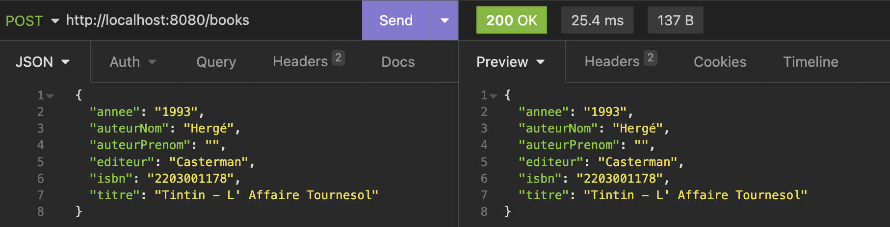

# WebService Books pour formation avec JAX-RS

Une fois le projet démarré, il faut accéder à l'url via un Navigateur Web ou une application de requête (insomnia, postman, curl , etc.).

Les Urls disponibles sont :
- GET: http://localhost:8080/books
- GET: http://localhost:8080/books/123 (isbn=123)
- POST: http://localhost:8080/books (avec un body ayant les bonnes informations)
- DELETE: http://localhost:8080/books/123 (isbn=123)

Exemple de POST:
